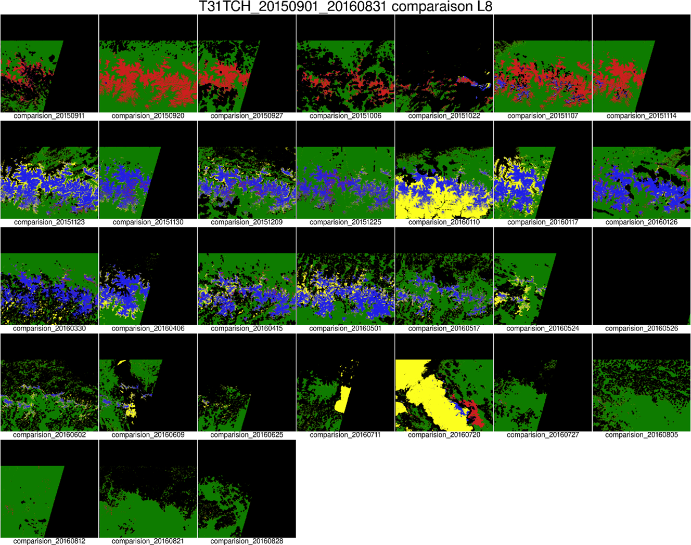
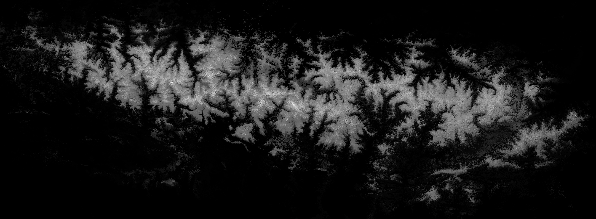
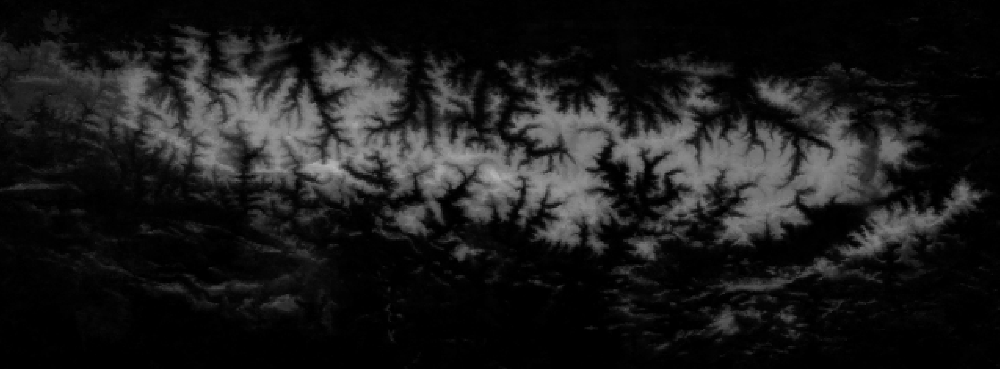
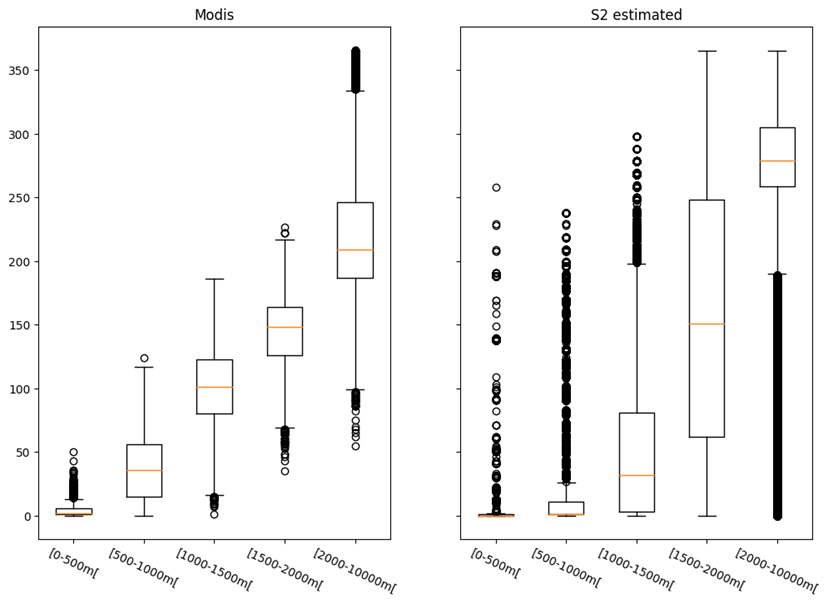

# Snow Annual Map

This file describe the snow annual map generation algorithm.

## Objectives:

The main objective was to create a product providing the synthesis of the snow cover on an annual basis over mountain regions. This product relies on LIS snow products computed over different L2A optical products such as S2 or L8, and uses a multi-temporal approach.

The approach is validated with Modis and Landsat 8 products.

**General approach:**

- First a timeserie is created from LIS snow products corresponding to the desired time range. (a snow season goes from 01/09 of one year to 31/08 of the next one) 
- Then, the timeserie is interpolated using the [otbImageTimeSeriesGapFilling](https://gitlab.orfeo-toolbox.org/jinglada/temporalgapfilling) application to obtain sampling on a daily basis.
- Finally, the daily timeserie is sum-up to obtain a single image in grayscale, representing the number of snow days. 

## Detailed approach
### Data Collection

The snow products are collected for one type of sensor only and must be at the same resolution *tile\_id*, *date\_start*, *date\_stop*.

Moreover the snow products are collected with a margin of +-15 days outside the requested time range to avoid any extrapolation. (parameter *date\_margin*)

The collected products are stored in *input\_products\_list*.

### Densification

Additional heterogeneous (different sensor, resolution) snow products can be provided trought the densification options(*use_densification* and *densification\_products\_list*) to increase the timeserie sampling.

These additional products are resample at the same resolution and same footprint than the main snow products. For that operation, we are currently using the [otbSuperimpose](https://www.orfeo-toolbox.org/CookBook/Applications/app_Superimpose.html) application with a Nearest Neighbor interpolator. The choice of the interpolator type is constrained by the snow mask pixel coding convention:

- 0, No-Snow
- 100, Snow
- 205, Cloud
- 254, No-data

These resampled denfication snow products are append to the empty dates of the previous collection, or fused with other products as described in the following section.

### Data fusion

In the case where multiple products are available at the same date, we perform a fusion step to obtain a single snow mask.
This fusion step allows to fill some cloud/nodata from the *input\_products\_list* with data from the *densification\_products\_list*.

It is performed in [snow\_annual\_map.py](https://gitlab.orfeo-toolbox.org/remote_modules/let-it-snow/blob/develop/python/s2snow/snow_annual_map.py) by the method *merge\_masks\_at\_same\_date()*.

    The fusion is performed according the following selection:
      if img1 != cloud/nodata use img1 data
      else if img2 != cloud/nodata use img2 data
      else if imgN != cloud/nodata use imgN data
    The order of the images in the input list is important:
      we expect to have first the main input products
      and then the densification products

The resulting snow mask follows the same pixel encoding than the original snow products. 

### Data convertion and Timeserie creation

The snow products pixel coding convention being not supported by the timeserie interpolation application, each snow masks is converted into two different masks:

1. a binary snow mask:
	- 0, No-snow
	- 1, Snow
1. a binary cloud/nodata mask:
	- 0, valid, clear observation
	- 1, not valid, no observation due to cloud/nodata

At this point each binary mask is append into a vrt file to match the format of timeserie supported by the interpolation application:

        "input_dates.txt"
        "multitemp_snow_mask.vrt"
        "multitemp_cloud_mask.vrt"

Inside the two vrt, the bands are indexed according the observation dates contained in "input_dates.txt".

### Timeserie interpolation

The timeserie interpolation is then performed using the the [otbImageTimeSeriesGapFilling](https://gitlab.orfeo-toolbox.org/jinglada/temporalgapfilling) application with a linear interpolator option.
The ouput interpolated timeserie is sampled on a daily basis between the initial *date\_start* and *date\_stop* parameters. The sampled dates are available in the text file "output\_dates.txt", and the bands are sorted in the output image accordingly.

### Results

Finally, each daily snow masks of the interpolated timeserie is summed into a single band using the [otbBandMath](https://www.orfeo-toolbox.org/CookBook/Applications/app_BandMath.html) aplication. The resulting snow annual map pixels are encoded in uint16 between [0-365].

Here is an example of a typical snow annual map generated by the processing.

")

## Validation

The approach was validated against reference data by two methods at different steps of the processing:

1. Quality of the snow mask daily interpolation, compared to actual L8 snow products:
1. Quality of the annual snow map, compared to MODIS snow annual map obtained from daily observation

### L8 comparision
For each L8 snow products available within the timeserie coverage, we generate a comparision map between the interpolated mask and the actual L8 snow mask.

The pixels are coded as follows:

- Green: No-snow L8, interp (True-Negative)
- Blue: Snow L8 and interp (True-Positive)
- Red: No-snow L8, Snow interp (False-Positive)
- Yelow: Snow L8, No-snow interp (False-Negative)

We also generate a confusion matrix to quantify the observation made from the comparision map.

The overall quality of the interpolation is satisfying as long as the gaps between two consecutive observations is not higher than 15 days, especially when snow changes occurs at pixel level. 

Caveats:
The quality of the interpolation is highly dependent on the sampling of the observations contributing to the timeserie.
In concequences, missing observation related clouds or nodata may cause interpolation artefacts by increasing the time gap between two consecutives actual observations.
The quality of the interpolation is also dependent on the quality the snow product used in the timeserie, any wrong snow detection will be indifferently be interpolated and will propagate the error.

### Modis comparision

For the Modis comparision, we compare the Modis snow annual map obtained from a gapfilled Modis timeserie with the Sentinel 2 snow annual map. The two annual maps are repported below:

***S2:*** 
***Modis:*** 

For each maps, we compute the statistics based on altitudes slices. A graphic comparing the population of number of snow days is available below. The results show two main differences:

- For lower altitude slices (<1500m), S2 map shows some under detection of the snow. This can be explained by the lower s2 revisit which miss short snow periods that occurs at these altitudes.
- For higher altitude slices (>2000m), S2 map shows some over detection of the snow. This can be explained by the higher s2 resolution which better detect small snow areas present on the mountain summits. This areas are then widely interpolated causing this sligth over detection.

Notes: this results are slightly outdated as they considers only years 2015-2016, for which S2 has mainly S2A products causing a revist quite twice lower than with S2B products. The 5 days revisit of S2A and S2B, should now improved this results that need to be recomputed.

***Graph comparision:*** 

## Application launcher

The snow annual map processing can be launch as follows:

    run_snow_annual_map.py param.json

Where 'param.json' is a configuration file containing the supported parameters according the json schema describes by [snow_annual\_map\_schema.json](https://gitlab.orfeo-toolbox.org/remote_modules/let-it-snow/blob/develop/doc/snow_annual_map_schema.json)

## Product format

Each product are identified by a tag according the following naming convention: [TILE\_ID]\_[DATE\_START]\_[DATE_STOP]

Here is a product tag example: **T31TCH\_20170901\_20180831**

Product content description:

1. Raster: **DAILY\_SNOW\_MASKS\_<*tag*>.tif**, the snow timeserie file interpolated on a daily basis (1 image with one band per day). Each band are coded as follows (the interpolation removing any clouds or nodata):
	- 0: No-snow
	- 1: Snow

- Raster: **SNOW\_OCCURENCE\_<*tag*>.tif**, the snow annual map image, pixel values within [0-365] corresponding the number of snow days.

- Raster: **CLOUD\_OCCURENCE\_<*tag*>.tif**, the cloud/nodata annual map image, pixel values within [0-number of observation days] corresponding the number of cloud/nodata days among the day of observation in the non-interpolated timeserie

- Text file: **input_dates.txt**, the list of observation dates in the non-interpolated timeserie
- Text file: **output_dates.txt**, the list of interpolated dates

- JSON file: **params.json**, the configuration files used for the products generation (optional)

- LOG file: **stdout.log**, the log file for the standard output generated during processing (optional)

- LOG file: **stderr.log**, the log file for the error output generated during processing (optional)

Note: In case of densification, the nodata value is set automatically to 0 causing some transparency of the snow map background in the tif viewer applications. 

## Production

The current snow annual map production covers Pyrenees and Alps for three snow seasons (2015-2016, 2016-2017, 2017-2018), using S2 and L8 snow products [distibuted by Theia](https://theia.cnes.fr/atdistrib/rocket/#/search?collection=Snow). When the snow products were not available trough the webportal, the snow products were generated from the L2A products using LIS snow detector.
A blog ticket showing the results of the production covering Pyrenees and Alps for the snow seasons 2016-2017 and 2017-2018 is available, and it also provides comparision between the snow annual cover and the ski stations implentation.

Link to the ticket blog:  [http://www.cesbio.ups-tlse.fr/multitemp/?p=14620](http://www.cesbio.ups-tlse.fr/multitemp/?p=14620).

Link to the interactive map: [http://osr-cesbio.ups-tlse.fr/echangeswww/majadata/simon/snowMaps.html](http://osr-cesbio.ups-tlse.fr/echangeswww/majadata/simon/snowMaps.html).

